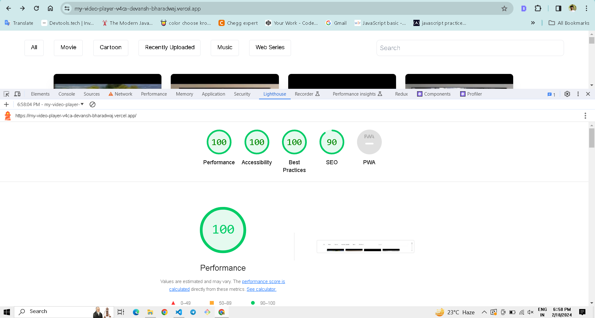

<!-- This is a [Next.js](https://nextjs.org/) project bootstrapped with [`create-next-app`](https://github.com/vercel/next.js/tree/canary/packages/create-next-app).

## Getting Started

First, run the development server:

```bash
npm run dev
# or
yarn dev
# or
pnpm dev
# or
bun dev
```

Open [http://localhost:3000](http://localhost:3000) with your browser to see the result.

You can start editing the page by modifying `app/page.tsx`. The page auto-updates as you edit the file.

This project uses [`next/font`](https://nextjs.org/docs/basic-features/font-optimization) to automatically optimize and load Inter, a custom Google Font.

## Learn More

To learn more about Next.js, take a look at the following resources:

- [Next.js Documentation](https://nextjs.org/docs) - learn about Next.js features and API.
- [Learn Next.js](https://nextjs.org/learn) - an interactive Next.js tutorial.

You can check out [the Next.js GitHub repository](https://github.com/vercel/next.js/) - your feedback and contributions are welcome!

## Deploy on Vercel

The easiest way to deploy your Next.js app is to use the [Vercel Platform](https://vercel.com/new?utm_medium=default-template&filter=next.js&utm_source=create-next-app&utm_campaign=create-next-app-readme) from the creators of Next.js.

Check out our [Next.js deployment documentation](https://nextjs.org/docs/deployment) for more details. -->

<!-- lg:w-64 mx-3 sm:w-5/12 w-full w-18-pr -->

# Video Player Assignment

## Technology Stack

- NextJS (v14.1.0) with TypeScript
- Tailwind CSS for styling

## Running Locally

1. Clone the repository:
   ```
   git clone https://github.com/Devansh-bharadwaj/new-video-player.git
   ```
2. Install dependencies:
   ```
   npm install
   ```
3. Start the development server:
   ```
   npm run dev
   ```
4. Open the project at [http://localhost:3000/](http://localhost:3000/) in your browser.

## Project Structure

### Data Management

- A "data" folder in the project root contains a "data.json" file for storing video data in JSON format.
- Implemented API methods in `src/app/api/videos/route.ts` for reading and updating the "data.json" file.

### Service Integration

- Utilized Axios in `src/app/Service.ts` to fetch data from the implemented API methods.

### State Management

- Created a context for centralized storage of data and states.

### Home Components (src/app/page.tsx)

- `page.tsx` loads all video cards. Clicking on a card redirects to a new page where the video plays.
- We can also filter and search the videos here.

### src/app/video/[slug]/page.tsx

- Make video player for playing the video and have all the controlls.
- Also a videoPlaylist component (src/app/components/VideoPlaylist.tsx) rendered here in which all the videos cards will load and we can drag and drop here for changing the order of playlist.

### Technologies

- Utilized the `react-player` package for the video player functionality.
- Implemented playlist reordering using the `react-beautiful-dnd` package.

### Functionality

- Implemented filtering and search functionality for easy data navigation in Navbar component (src/app/components/Navbar.tsx).

### Responsiveness

- Ensured full responsiveness across various devices.

### Live url link

- https://my-video-player-v4ca-devansh-bharadwaj.vercel.app/

### Lighthouse report



## License

This project is licensed under the [MIT License](LICENSE).
